dwi sasongko mukti  
175410010  
Praktikum Teknologi Clouud Computing

1.Instalasi GIT pada windows  
==> Setelah download Git, double click pada file yang di-download. Akan dimunculkan lisensi. Klik Next untuk lanjut.  
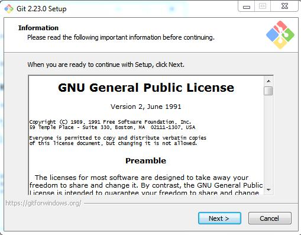  

==> Setelah itu, pilih lokasi instalasi. Secara default akan terisi C:\Program Files\Git. Ganti lokasi jika memang anda menginginkan lokasi lain, klik Next  
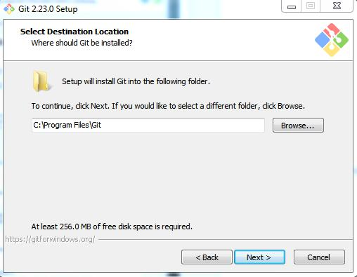  

==> Pilih komponen. Tidak perlu diubah-ubah, sesuai dengan default saja. Klik pada Next.  
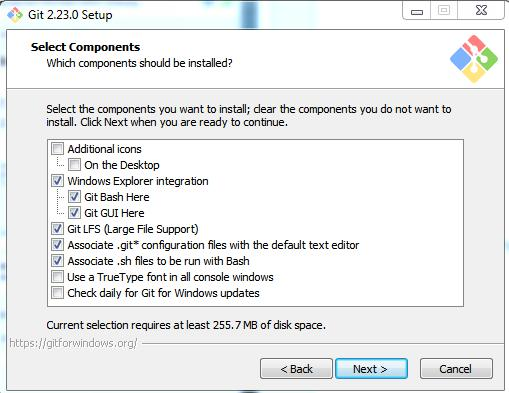  

==> Mengisi shortcut untuk menu Start. Gunakan default (Git), ganti jika ingin mengganti - misalnya Git VCS.  
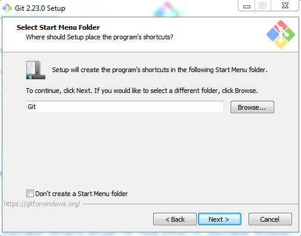  

==> Pilih editor yang akan digunakan bersama dengan Git. Pada pilihan ini, digunakan vim.  
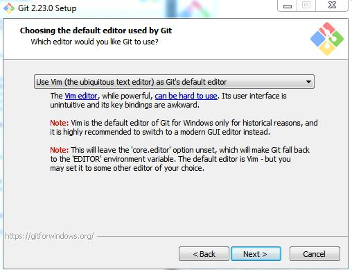  

==> Pada saat instalasi, Git menyediakan akses git melalui Bash maupun command prompt. Pilih pilihan kedua supaya bisa menggunakan dari dua antarmuka tersebut. Bash adalah shell di Linux. Dengan menggunakan bash di Windows, pekerjaan di command line Windows bisa dilakukan menggunakan bash - termasuk ekskusi dari Git.  
  

==> Pilih OpenSSH  
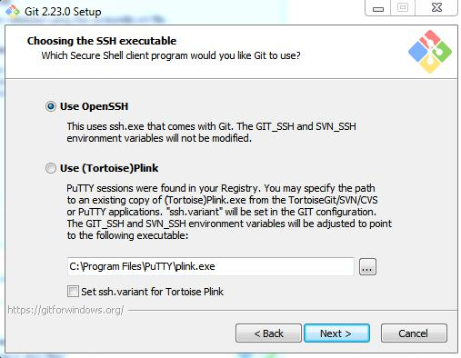  

==> Pilih OpenSSL untuk HTTPS. Git menggunakan https untuk akes ke repo GitHub atau repo-repo lain (GitLab, Assembla).  
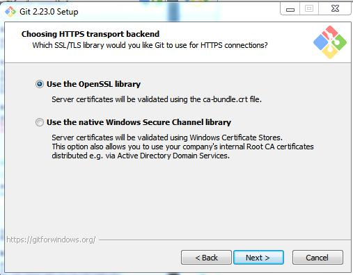  

==> Pilih pilihan pertama untuk konversi akhir baris (CR-LF).  
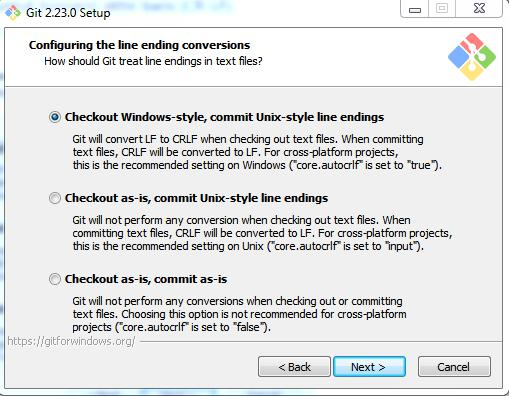  

==> Pilih PuTTY untuk terminal yang digunakan untuk mengakses Git Bash.  
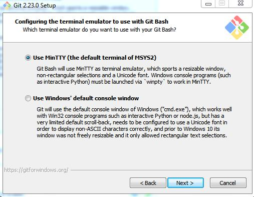  

==> Untuk opsi ekstra, pilih serta aktifkan 1 dan 2.  
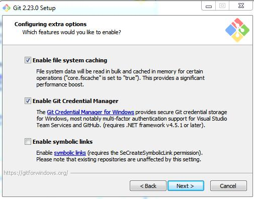  

==> Ketika muncul dialog pemberitahuan. Klik pada Finish.(centang pada view release notes)  
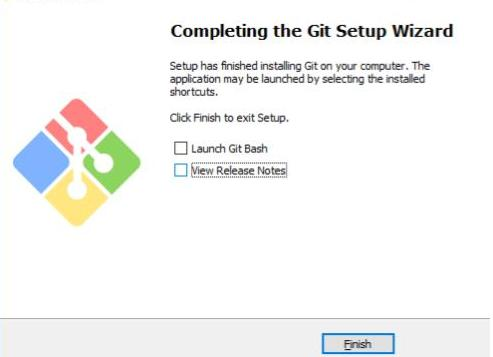  

==> Tampilan jika akan menggunakan "Git Bash"  
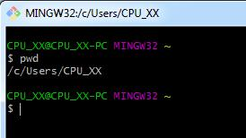  

==> Tampilan jika akan menggunakan "Git GUI"  
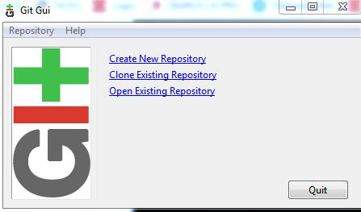  

==> Untuk mencoba dari command prompt, masuk ke command prompt, setelah itu eksekusi "git --version" untuk melihat apakah sudah terinstall atau belum. Jika sudah terinstall dengan benar, makan akan muncul hasil berikut:  
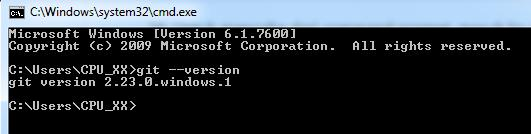  

2.Konfigurasi GIT  
==> Secara minimal, user harus memberitahu Git tentang username serta email yang digunakan setiap kali terjadi perubahan pada repo Git. Username serta email ini yang akan dimasukkan oleh Git ke catatan perubahan di repo.  
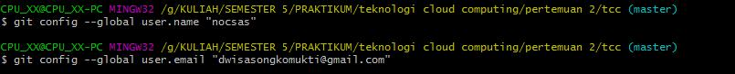  

==> Isian di atas harus disesuaikan dengan nama serta email yang digunakan untuk mendaftar di GitHub. Untuk melihat konfigurasi yang sudah ada:  
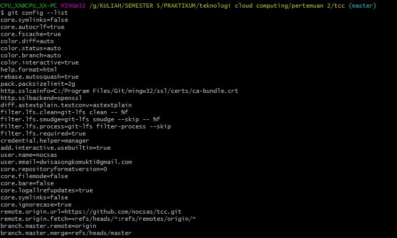  

3.Mengelola Repo Sendiri  
==> Clone Repo  
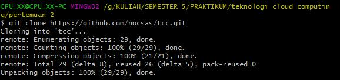  

==> Menambahkan Semua File Ke Repo  
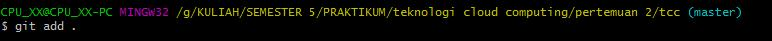  

==> Melihat File Yang Ditambahkan Ke Repo  
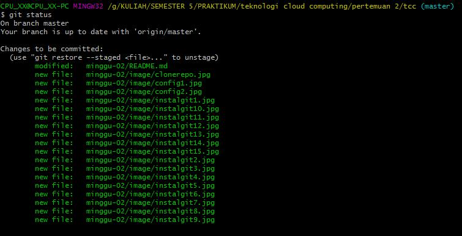  

==> Melakukan Commit  
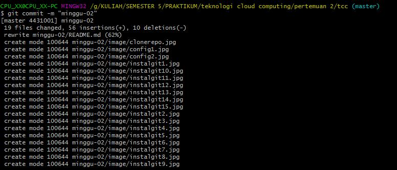  

==> Melakukan Push Ke Repo  
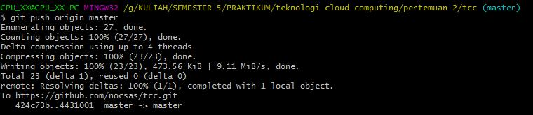  

==> Perintah Membaca File  
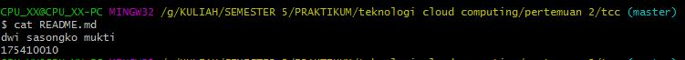  