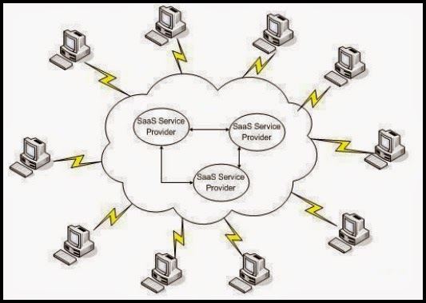
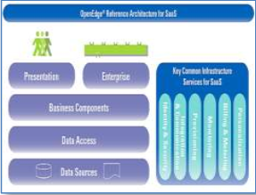
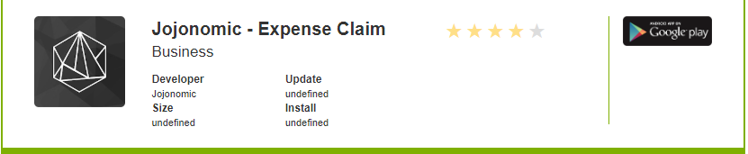

Nama : dwi sasongko mukti  
Nim : 175410010  
Jurusan : Teknik Informatika  
Matkul : Praktikum Teknologi Cloud Computing  
***  

# Software as a service (SaaS)  

Kata - kata Software merujuk kepada perangkat lunak suatu system, dimana perangkat lunak pada umumnya memiliki beragam karakteristik. Tidak semua perangkat lunak yang beredar di pasaran dapat dikategorikan sebagai SaaS,
Beberapa karakteristik yang harus terpenuhi :  
  1. Berbasis  internet  :  software  harus  dapat  diakses  dan  dikelola  oleh  pengguna  melalui media internet.  
  2. Software  bersifat  terpusat  atau  ter-sentral  sehingga  memungkinkan  pengguna  untuk mengaksesnya darimana dan kapan saja.  
  3. Memiliki  fasilitas  untuk  meng-update  atau  meng-upgrade  secara  terpusat  sehingga pengguna tidak perlu download patch atau upgrade di masing – masing komputer.  
  4. Aplikasi yang ditawarkan oleh provider bersifat multi tenant.  

Software as service merupakan evolusi lanjutan dari konsep ASP ( Application Service Provider). Software as service  adalah istilah terhadap  software  atau aplikasi tertentu berbasis internet yang  ditawarkan  oleh  provider  kepada  pengguna.  provider  sebagai  pemegang license atas software tersebut hanya memberikan service atau layanan kepada pengguna untuk menggunakannya  sesuai  kebutuhan  pengguna. License,  maintenance,  support, tingkat  kenyamanan  dan  keamanan  atas  software  tersebut  sepenuhnya  menjadi  tanggung jawab dari provider.  

### Keuntungan layanan SaaS  
1.  Model  rancangan  dan  distribusi  software  lebih  menarik  dan  harga  terjangkau  karena memungkinkan membagi satu aplikasi kepada ratusan perusahaan dan berjalan dalam lingkungan  sistem  biasa.  Secara  luas  memberikan  improvisasi  kepada  model  client /server.  
2.  Biaya pemakaian bandwidth untuk menjaga tingkat konektivitas relatif terjangkau.  
3.  Mempermudah pengguna untuk melakukan migrasi aplikasi, dengan menghilangkan sisi pembayaran license software dan keharusan membayar upgrade.  
4.  Meningkatkan produktivitas bagi pengguna.  
5.  Meningkatkan produktivitas bagi pengguna.  

Gambar berikut,, menjelaskan ketika provider mempublikasikan suatu layanan SaaS di internet dan satu atau beberapa pengguna saling menggunakannya secara bersama – sama atau on demand di dalam internet.  
  

### Implementasi layanan SaaS  
Implementasi cloud computing dapat diterapkan pada jaringan yang bersifat public atau jaringan yang bersifat private. Jaringan yang bersifat public adalah suatu jaringan yang dapat diakses dan digunakan secara umum oleh setiap orang selama orang tersebut terkoneksi dengan internet sedangkan jaringan yang bersifat private adalah suatu jaringan yang hanya dapat diakses dan digunakan oleh orang – orang tertentu meskipun melalui koneksi internet.  
Ketika cloud computing diimplementasikan ke dalam jaringan public, maka seluruh sumber daya atau resources dari aplikasi sepenuhnya berada internet. Layanan SaaS yang bersifat public sering kita jumpai dalam bentuk aplikasi web atau web services.  
Ketika provider meletakkan seluruh sumber daya atau resources dari aplkasi ke dalam internet tetapi hanya beberapa orang yang dapat menggunakannya maka layanan SaaS tersebut bersifat private.  
SaaS yang ditawarkan provider kepada pengguna baik melalui jaringan public maupun jaringan private pada dasarnya mempunyai satu karakteristik yang sama yaitu mudah diakses dan berskala luas ( upgrade aplikasi, modifikasi aplikasi disesuaikan dengan kebutuhan dan keinginan pengguna ).  
Berbagai SaaS yang dibuat oleh provider sering disebut dalam berbagai versi yaitu versi berbasis web, on demand dan sebagainya. Apapun versi yang dibuat oleh provider, yang diperlukan oleh pengguna adalah koneksi internet untuk dapat menggunakan SaaS tersebut.  
Metodologi pengembangan dari SaaS memiliki kesamaan dengan pengembangan software desktop baik dari sisi kemampuan aplikasi diakses dalam skala besar, tingkat keamanan dan aplikasi yang nyaman digunakan oleh pengguna.  

### Arsitektur SaaS  
Model SaaS   meliputi   konsep-konsep dalam   arsitektur   aplikasi   terdistribusi tetapi lebih lanjut memperluas arsitektur untuk   menyertakan   komponen   untuk memfasilitasi  dan  meningkatkan  model bisnis.  Sebuah  vendor  perangkat  lunak tradisional terutama   berkaitan   dengan kemampuan    aplikasi    dan    pelanggan mereka  yang  bertanggung  jawab  untuk mengoperasikan        dan        mengelola lingkungan  yang  bersangkutan  di  mana mereka menjalankan perangkat lunak.   

Sebuah  vendor SaaS, di sisi lain, adalah sama-sama           memperhatikan pengoperasian         dan         pengelolaan lingkungan   yang   mendukung   seluruh pelanggan mereka. 

Cloud    Software    asaService(SaaS). Kemampuan    yang    diberikan    kepada konsumen  adalah  dengan  menggunakan aplikasi   penyedia   yang   berjalan   pada infrastruktur     awan.     Aplikasi     dapat diakses   dari   berbagai   perangkat   klien melalui   antarmuka thin-clientseperti Web  browser  (misalnya,  Web-basede-mail).  Konsumen  tidak  mengelola  atau mengendalikan      infrastruktur      awan termasuk     jaringan,     server,     sistem operasi,  penyimpanan,  atau  kemampuan aplikasi     bahkan     individu,     dengan pengecualian     terbatas     khusus     bagi pengguna  untuk  pengaturan  konfigurasi aplikasi.  

Gambar     di bawah     menunjukkan     diagram konseptual   dari   arsitektur   yang   lebih komprehensif.    Sebuah    tier    distribusi ditambahkan   untuk   mengakui   bahwa permintaan    layanan    mungkin    perlu diarahkan     pada     lebih     dari     satu lingkungan operasi fisik karena berbagai alasan.      Tier      Komponen      aplikasi tambahan yang memperhitungkan fungsi tambahan penawaran  SaaS yang  matang yang         mungkin         diperlukantelah diidentifikasi.               Masalah-masalah administrasi  dan  pemantauan  disajikan sebagai  komponen  yang  beroperasi  di seluruh         tingkatan.         Komponen-komponen   ini   sangat   penting   untuk operasi yang efisien dari bisnis SaaS.  
  

Tier  distribusi  ditambahkan  ke  model arsitektur  SaaS  untuk  menangani load balancing.      Istilah      ini      umumnya berhubungan     dengan     teknik     untuk menyebarkan          pekerjaan          untuk mengoptimalkan   pemanfaatan   sumber daya, throughputatau   waktu   respon. Dengan bisnis SaaS ini tentu tepat untuk mempertimbangkan  sehingga  pelanggan anda   dapat   diberikan   dengantingkat pelayanan  sebaik  mungkin.  Namun,  ada alasan lain mengapa permintaan layanan mungkin  perlu  diarahkan  ke  berbagai lingkungan operasi fisik.  

Salah    satu    alasannya    adalah    untuk memanfaatkan beberapa pusat data yang secara  geografis  berbeda  untuk  alahan kehandalan.     Idenya     adalah     bahwa pelanggan  yang berbeda dapat dialihkan ke  situs  utama  yang  berbeda.  Semua situs  yang  digunakan  untuk  permintaan layanan  produksi  dan  mereka  bertindak sebagai  situs  alternatif  antara  satu  sama lain,    sehingga    lebih    efisien    dalam memanfaatkan      sumber      daya      dan meningkatkan ketersediaan pusat data.Alasan  lain  untuk  routing  permintaan layanan    pelanggan    tertentu    dengan lingkungan   tertentu.   Faktanya   adalah bahwa  data  pribadi  merupakan  masalah besar     dan     berbagai     negara     telah mengambil    pendekatan    yang    sangat berbeda  untuk  melindungi  data  warga mereka.     Meskipun     upaya,     seperti program  sertifikasi  telah  dikembangkan untuk  memfasilitasi  kepatuhan  terhadap privasihukum,  sejumlah  pelanggan  dari negara  tertentu  mungkin  mengharuskan data   perusahaan   mereka   secara   fisik disimpan  di  negara  mereka.  Jika  vendor SaaS  ingin  mengembangkan  bisnis  di negara   tersebut,   lingkungan   produksi internasional   yang   berbeda   mungkin diperlukan  dan  routing  permintaan  akan diperlukan.  

### Contoh Aplikasi SaaS  
#### Jojonomic  
Dari awal dikembangkan, Jojonomic telah berkembang dari layanan perencanaan keuangan individu ke platform reimburse karyawan. Reimbursement manual dapat sangat menyulitkan, tetapi Jojonomic membantu untuk digitalisasi proses tersebut sehingga pelaku bisnis dapat dengan cepat dan mudah menyetujui dan melakukan kontrol biaya yang dikeluarkan karyawan mereka. Startup ini mencoba membantu perusahaan untuk menyelesaikan tantangan tersebut menggunakan teknologi berbasis komputasi awan dan OCR (Optical Character Recognition).  
  