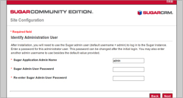
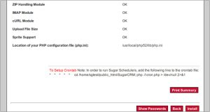

Nama    : dwi sasongko mukti  
NIM     : 175410010  
Jurusan : Teknik Informatika  
MatKul  : Praktikum Teknologi Cloud Computing 
***********

# BPaaS  
Proses Bisnis Sebagai Layanan (BPaaS) adalah jenis proses bisnis horizontal atau vertikal yang disampaikan berdasarkan model layanan awan. Layanan awan ini - yang mencakup Perangkat Lunak sebagai Layanan (SaaS), Platform sebagai Layanan (PaaS), dan Infrastruktur sebagai Layanan (IaaS) - oleh karena itu bergantung pada layanan terkait.  

Perusahaan telah mengotomatisasi proses bisnis selama beberapa dekade. Awalnya, mereka terpaksa melakukannya secara manual atau pemrograman. Misalnya, jika perusahaan ingin memastikan bahwa sistem manajemen untuk pesanan mendongak cek kredit sebelum mengeluarkan transaksi, perusahaan membuat permintaan itu ke dalam sebuah program.  

Dalam beberapa kasus, seluruh proses bisnis perusahaan outsourcing dapat menerapkan proses secara manual atau melalui otomasi. Dengan dimulainya komputasi awan, pendekatan ini mulai berubah. Semakin banyak perusahaan melihat pendekatan layanan yang berorientasi pada layanan. Alih-alih menganggap Anda memerlukan aplikasi paket yang mencakup logika bisnis, data, dan proses, mungkin saja Anda memilih aplikasi proses yang tidak terkait dengan satu aplikasi.  

Ada alasan praktis untuk memilih layanan proses bisnis. Pertama, organisasi dapat memilih proses yang sesuai dengan kebijakan bisnis. Ini kemudian dapat digunakan di banyak lingkungan aplikasi yang berbeda. Ini memastikan bahwa proses yang konsisten dan pasti, yang konsisten ada di seluruh organisasi. Misalnya, perusahaan mungkin memiliki proses yang kompleks untuk memproses gaji atau mengelola pengiriman. Layanan ini dapat dihubungkan ke layanan lain di awan, seperti SaaS, dan juga aplikasi di pusat data.  

Seperti layanan awan SaaS, proses bisnis mulai dirancang sebagai penawaran kemasan yang dapat digunakan dengan cara hibrida. Bagaimanapun, proses bisnis adalah langkah yang Anda ambil atau aktivitas yang Anda lakukan untuk memfasilitasi penyampaian produk atau layanan kepada pelanggan atau pemangku kepentingan Anda. Proses bisnis ini benar-benar bisa menjadi layanan yang bisa dilakukan secara otomatis, termasuk mengelola e-mail, mengirimkan paket, atau mengelola kredit pelanggan.  

Perbedaan antara aplikasi kemasan tradisional dan BPaaS adalah bahwa BPaaS dirancang untuk berorientasi pada layanan. Jadi, BPaaS cenderung memiliki antarmuka yang terdefinisi dengan baik. Selain itu, BPaaS adalah layanan standar untuk digunakan oleh banyak organisasi yang berbeda. Karena layanan ini jauh lebih optimal untuk memberikan layanan secara konsisten, mereka dapat memanfaatkan otomasi, standarisasi, dan pengulangan dalam cara layanan digunakan dan dikirimkan.  

Karakteristik berikut menentukan BPAaS:  
1. BPaaS duduk di atas tiga layanan awan pendiri lainnya: SaaS, PaaS, dan IaaS.  
2. Layanan BPaaS dapat dikonfigurasi berdasarkan proses yang sedang dirancang.  
3. Layanan BPaaS harus memiliki API yang terdefinisi dengan baik sehingga mudah dihubungkan ke layanan terkait.  
4. BPaaS harus dapat mendukung banyak bahasa dan beberapa lingkungan penerapan karena bisnis tidak dapat memprediksi bagaimana proses bisnis akan dimanfaatkan di masa depan.  
5. Lingkungan BPaaS harus bisa menangani skala besar. Layanan harus bisa pergi dari pengelolaan beberapa proses untuk beberapa pelanggan untuk dapat mendukung ratusan bahkan ribuan pelanggan dan proses. Layanan ini mencapai tujuan tersebut dengan mengoptimalkan layanan awan yang mendasari untuk mendukung jenis elastisitas dan penskalaan ini.  

## Contoh Aplikasi BPaaS  
### SugarCRM  

#### Pengertian SugarCRM  

SugarCRM adalah aplikasi Customer Relationship Management yang memungkinkan anda secara efisien, dan teratur mengelola informasi relasi dengan customer dalam segala aspek. SugarCRM menyediakan management informasi yang terintegrasi, diantaranya: akun customer dan kontak , lead penjualan dan kesempatan, penggunaan alur kerja, termasuk calls, meeting, dan assigned tasks scheduling.  

SugarCRM adalah sebuah aplikasi komersial kelas dunia untuk aplikasi manajemen hubungan pelanggan (Customer Relationship Management) dan yang terbaik di lingkungan Open Source. SugarCRM dapat digunakan oleh berbagai ukuran perusahaan, dari perusahaan kecil hingga perusahaan besar.  

Dalam pengembangannya Sugar CRM melibatkan banyak narasumber dari mulai operator pengguna aplikasi CRM, para pelanggan, pengembang, dan para Ahli yang menyatukan kebutuhannya, opini, serta pengalaman ke dalam solusi SugarCRM.  

#### Cara Instal SugarCRM  

1. Sebelum menginstal program ini pertama yang harus dilakukan adalah meng-copy folder sugar crm ke C:\xampp\htdocs setelah itu aktifkan xampp. Kemudian buka browser internet anda setelah itu pergi ke alamat http://localhost/SugarCE.  
2. Pertama setelah kita masuk pada halaman utama dari alamat yang kita ketik kita akan langsung mendapat sambutan dari program, selanjutnya yang kita lakukan adalah dengan meng-klik next.  
3. Selanjutnya ketika kita klik tombol Next, kita akan masuk pada halaman informasi dimana prosedur instalasi dan sistem pemeriksa. Selanjutnya pilih Saya Setuju kotak centang di bagian bawah dan lanjutkan ke langkah berikutnya. Hal ini untuk memastikan semua file memiliki izin yang diperlukan dan server kompatibel dengan instalasi.  
  
4.  Selanjutnya anda akan diminta untuk memilih apakah akan menyelesaikan Opsi pertama direkomendasikan untuk pengguna baru dan pengaturan tambahan dapat diaktifkan setelah akhir instalasi dan selanjutnya klik tombol next.  
  
5.  Selanjutnya, yang dilakukan adalah dengan memilih atau menandai jenis database MySQL dan selanjutnya klik tanda next.  
  
6.  Selanjutnya konfigurasi database harus ditentukan, Jika server MySQL terletak pada server yang sama di mana instalasiakan dilakukan menggunakan localhost untuk Host Name. Untuk Nama Database, Database Administrator Username dan Password Admin database memasukkan rincian yang telah ditetapkan di Panel-> MySQLDatabases.  
7.  Setelah selesai dari proses sebelumnya, Anda dapat memilih Database mengisi dengan opsi data.  
  
8. Pada halaman berikutnya tentukan username dan password administrator. Klik Next dan halaman dengan pengaturan database dan lingkungan dan kepercayaan sistem akan divisualisasikan.  
  
9. Klik pada tombol Install untuk menyelesaikan instalasi skrip.  
  
10.  Setelah selesai proses sebelumnya Anda memiliki pilihan untuk register produk atau hanya untuk membuka Sugar CRM home page.  
 

#### Fungsi Umum  
-  Membuat akun dan kontak, serta membuat hubungan antara beberapa kontak dengan satu akun tertentu.  
-  Membuat hubungan antar data yang terkait.  
-  Membuat dan melacak sales dari lead sampai ke opportunies, kontak, dan akun.  
-  Membuat dan memonitor aktifitas penjualan dan riwayat akumulasi penjualan.  
-  Membuat jadwal aktifitas dengan kolega.  

#### Opsi yang ada pada menu shortcut antara lain:  
-  Buat Akun, klik opsi ini untuk membuat akun baru.  
-  Akun, klik opsi ini untuk melihat daftar akun yang ada.  
-  Import, klik opsi ini untuk import informasi akun dari data eksternal.  

#### KELEBIHAN DAN KEKURANGAN SUGAR-CRM  
1. Kelebihan  
    - Open source, sehingga lebih murah ketika digunakan oleh perusahaan kecil atau sedang.  
    - Data dari user yang sudah masuk bisa tersimpan dalam sebuah database.  
    - Lebih mudah digunakan karena model program yang simple. 
    - Dapat menampilkan Warning atau Reminder.  
    - Dapat dilakukan analisis mengenai customer berdasarkan kriteria tertentu.  
    - Masing-masing item yang ada ( Contacts, Accounts dan lain-lain )   yang dapat saling berhubungan atau berkaitan.  

2. Kekurangan  
    - Ketika proses membaca data loading terlalu lama.  
    - Tampilan kurang menarik karena sangat simple.  
    - Tidak ada multiple languages.  
    - Penginstalan cenderung rumit dan kadang kala gagal pada saat proses penginstalan.  
    - Memerlukan update.  
