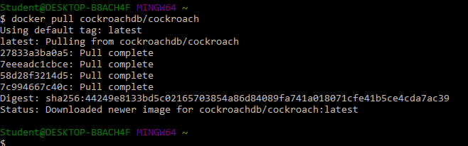

Nama    : dwi sasongko mukti  
NIM     : 175410010  
Jurusan : Teknik Informatika  
Tecnologi Cloud Computing  
*****************************

# CockroachDB  
## 1.Install  
 

## 2.Konfigurasi  
a. Membuat Bridge Network pada docker  

    $ docker network create -d bridge roachnet
    49fccc74a2524ffd5a05eb011155380c072c0a31873f05d97e926667a1487e36  
b. Menjalankan service cockroachdb  

    $ docker run -d --name=roach1 --hostname=roach1 --net=roachnet -p 26257:26257 -p 8080:8080 cockroachdb/cockroach start --insecure  
c. Cek container, pastikan UP  

    $ docker ps -a
    CONTAINER ID        IMAGE                   COMMAND                  CREATED             STATUS              PORTS                                              NAMES
    dbc1f3190f58        cockroachdb/cockroach   "/cockroach/cockro..."   4 seconds ago       Up 4 seconds        0.0.0.0:8080->8080/tcp, 0.0.0.0:26257->26257/tcp   roach1  
d. Test Cluster  

    $ docker exec -it roach1 ./cockroach sql --insecure
    # Welcome to the cockroach SQL interface.
    # All statements must be terminated by a semicolon.
    # To exit: CTRL + D.
    #
    # Server version: CockroachDB CCL v19.1.5 (x86_64-unknown-linux-gnu, built 2019/09/23 14:12:16, go1.11.6) (same version as client)
    # Cluster ID: aec879f9-844b-46cc-aa81-0af7d201a408
    #
    # Enter \? for a brief introduction.
    #
    root@:26257/defaultdb>  
## 3.Membuat Database  

    root@:26257/defaultdb> create database sasongko;
    CREATE DATABASE

    Time: 5.420966ms

    root@:26257/defaultdb> show databases;
      database_name
    +---------------+
      defaultdb
      sasongko
      postgres
      system
    (4 rows)

    Time: 672.14µs  
## 4.Membuat Tabel  
a. Masuk Database

    root@:26257/defaultdb> use sasongko;
    SET

    Time: 247.812µs  
b. Membuat Table  

    root@:26257/sasongko> CREATE TABLE sasongko.accounts (id INT PRIMARY KEY, balance DECIMAL);
    CREATE TABLE

    Time: 5.573474ms
c. Memasukkan data ke Tabel  

    root@:26257/nganu> INSERT INTO sasongko.accounts VALUES (1, 1000.50);
    INSERT 1

    Time: 4.914008ms
## 5.Menampilkan Data Table  

    root@:26257/sasongko> SELECT * FROM sasongko.accounts;
      id | balance
    +----+---------+
       1 | 1000.50
    (1 row)

    Time: 537.781µs