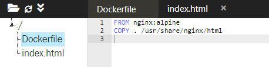

Nama    : dwi sasongko mukti  
NIM     : 175410010  
Jurusan : Teknik Informatika  
_________________  

>https://katacoda.com/courses/docker/deploying-first-container
# DEPLOYING FIRS CONTAINER  
## 1.Running a Container  
- To Find an image for Redis  
  
- By default, Docker will run a command in the foreground. To run in the background, the option -d needs to be specified.  
  

## 2.Finding Running Containers  
  

## 3.Accessing Redis  
- menjalankan Redis di latar belakang, dengan nama redisHostPort di port 6379
  
- menjalankan beberapa instance Redis dan mengkonfigurasi aplikasi tergantung pada port mana Redis sedang berjalan  
  

## 4.Persisting Data  
- menggunakan dokumentasi Docker Hub untuk Redis  
  

## 5.Running A Container In The Foreground  
- meluncurkan wadah Ubuntu dan mengeksekusi perintah ps untuk melihat semua proses yang berjalan dalam wadah dan mendapatkan akses ke bash shell di dalam sebuah wadah  
  

>https://www.katacoda.com/courses/docker/create-nginx-static-web-server  
# Deploy Static HTML Website as Container  
## 1.Create Dockerfile  
  
  

## 2.Build Docker Image  
- Build static HTML image  
  
- view a list of all the images on the host  
  

## 3.Run  
  
  
>https://2886795292-80-elsy04.environments.katacoda.com/  

  

>https://www.katacoda.com/courses/docker/2
# Building Container Images  
## 1.Base Images  
- Membuat Dockerfile, masukkan konfigurasi base image  

        FROM nginx:1.11-alpine  
## 2.Running Commands  
