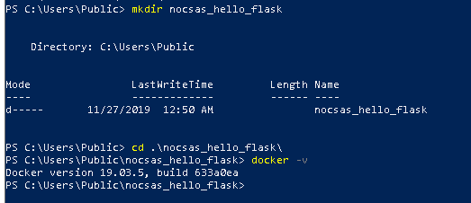

Nama : dwi sasongko mukti  
NIM : 175410010  
Jurusan : Teknik Informatika  
--------------------------  

# Docker + Python + Flask   
  
## Membuat Folder dan Masuk Ke Folder  
    mkdir nocsas_hello_flask
    cd .\nocsas_hello_flask\
  

## Install Flask (Insatal Python Dulu)
    pip install flask  
  

##  Membuat File app.py Didalam Folder nocsas_hello_flask  
    from flask import Flask
    from flask_restful import Resource, Api

    app = Flask(__name__)
    api = Api(app)

    class HelloWorld(Resource):
        def get(self):
            return {'hello': 'nocsas'}

    api.add_resource(HelloWorld, '/')

    if __name__ == '__main__':
        app.run(debug=True, host='0.0.0.0')  
 
## Membuat File requirements.txt Didalam Folder nocsas_hello_flask Yang Didalamnya Berisi Informasi Paket Yang Dibutuhkan Oleh Aplikasi Python Yang Akan Kita Buat  
    flask  
    flask_restful  

## Membuat Filr Dockerfile (Tanpa Extension)  
    FROM python:3.8
    COPY . /app
    WORKDIR /app
    RUN pip install -r requirements.txt
    ENTRYPOINT ["python"]
    CMD ["app.py"]  
From python sesuai versi python yang terinstall di komputer  

## Struktur FIle YAng Ada Di Folder nocsas_hello_flask  
    nocsas_hello_flask
    │
    └───requirements.txt
    │
    └───Dockerfile
    │
    └───app.py  

## Membangun Docker Image  
    C:\Users\Public\nocsas_hello_flask>docker build -t nocsas/nocsas_hello_flask:v1 .
    Sending build context to Docker daemon  4.096kB
    Step 1/6 : FROM python:3.8
    3.8: Pulling from library/python
    65014b3c3121: Pull complete
    e96b0897c5d1: Pull complete
    29b5e34c936e: Pull complete
    94e71c560beb: Pull complete
    0cebd8334f9f: Pull complete
    d7263148e707: Pull complete
    8262d98c2a68: Pull complete
    2fa8bc334077: Pull complete
    7ec5f83a86bb: Pull complete
    e71e360d4360: Pull complete
    6fbf29f2b0f5: Pull complete
    Digest: sha256:cea522e86d1a42e0bf339e9b615a3d76f2258916ee16dc562ff9182ef15ece05
    Status: Downloaded newer image for python:3.8
    ---> 73f8091f0284
    Step 2/6 : COPY . /app
    ---> baa645a335b3
    Step 3/6 : WORKDIR /app
    ---> Running in 1eea3642a902
    Removing intermediate container 1eea3642a902
    ---> b70ba3c12e71
    Step 4/6 : RUN pip install -r requirements.txt
    ---> Running in 097fe4a80d09
    Collecting flask
    Downloading https://files.pythonhosted.org/packages/9b/93/628509b8d5dc749656a9641f4caf13540e2cdec85276964ff8f43bbb1d3b/Flask-1.1.1-py2.py3-none-any.whl (94kB)
    Collecting flask_restful
    Downloading https://files.pythonhosted.org/packages/17/44/6e490150ee443ca81d5f88b61bb4bbb133d44d75b0b716ebe92489508da4/Flask_RESTful-0.3.7-py2.py3-none-any.whl
    Collecting itsdangerous>=0.24
    Downloading https://files.pythonhosted.org/packages/76/ae/44b03b253d6fade317f32c24d100b3b35c2239807046a4c953c7b89fa49e/itsdangerous-1.1.0-py2.py3-none-any.whl
    Collecting click>=5.1
    Downloading https://files.pythonhosted.org/packages/fa/37/45185cb5abbc30d7257104c434fe0b07e5a195a6847506c074527aa599ec/Click-7.0-py2.py3-none-any.whl (81kB)
    Collecting Jinja2>=2.10.1
    Downloading https://files.pythonhosted.org/packages/65/e0/eb35e762802015cab1ccee04e8a277b03f1d8e53da3ec3106882ec42558b/Jinja2-2.10.3-py2.py3-none-any.whl (125kB)
    Collecting Werkzeug>=0.15
    Downloading https://files.pythonhosted.org/packages/ce/42/3aeda98f96e85fd26180534d36570e4d18108d62ae36f87694b476b83d6f/Werkzeug-0.16.0-py2.py3-none-any.whl (327kB)
    Collecting aniso8601>=0.82
    Downloading https://files.pythonhosted.org/packages/eb/e4/787e104b58eadc1a710738d4e418d7e599e4e778e52cb8e5d5ef6ddd5833/aniso8601-8.0.0-py2.py3-none-any.whl (43kB)
    Collecting six>=1.3.0
    Downloading https://files.pythonhosted.org/packages/65/26/32b8464df2a97e6dd1b656ed26b2c194606c16fe163c695a992b36c11cdf/six-1.13.0-py2.py3-none-any.whl
    Collecting pytz
    Downloading https://files.pythonhosted.org/packages/e7/f9/f0b53f88060247251bf481fa6ea62cd0d25bf1b11a87888e53ce5b7c8ad2/pytz-2019.3-py2.py3-none-any.whl (509kB)
    Collecting MarkupSafe>=0.23
    Downloading https://files.pythonhosted.org/packages/b9/2e/64db92e53b86efccfaea71321f597fa2e1b2bd3853d8ce658568f7a13094/MarkupSafe-1.1.1.tar.gz
    Building wheels for collected packages: MarkupSafe
    Building wheel for MarkupSafe (setup.py): started
    Building wheel for MarkupSafe (setup.py): finished with status 'done'
    Created wheel for MarkupSafe: filename=MarkupSafe-1.1.1-cp38-none-any.whl size=12634 sha256=8d0ce22ff4e7a22d5bd65e9c2d05af1f37b150be90365aad60ff0ccb20549483
    Stored in directory: C:\Users\ContainerAdministrator\AppData\Local\pip\Cache\wheels\f2\aa\04\0edf07a1b8a5f5f1aed7580fffb69ce8972edc16a505916a77
    Successfully built MarkupSafe
    Installing collected packages: itsdangerous, click, MarkupSafe, Jinja2, Werkzeug, flask, aniso8601, six, pytz, flask-restful
    Successfully installed Jinja2-2.10.3 MarkupSafe-1.1.1 Werkzeug-0.16.0 aniso8601-8.0.0 click-7.0 flask-1.1.1 flask-restful-0.3.7 itsdangerous-1.1.0 pytz-2019.3 six-1.13.0
    Removing intermediate container 097fe4a80d09
    ---> 41b4c2bb3e5e
    Step 5/6 : ENTRYPOINT ["python"]
    ---> Running in f0cc2a3d7b86
    Removing intermediate container f0cc2a3d7b86
    ---> 182748e3e7fd
    Step 6/6 : CMD ["app.py"]
    ---> Running in 4d577314875d
    Removing intermediate container 4d577314875d
    ---> 609cbbb4ed3a
    Successfully built 609cbbb4ed3a
    Successfully tagged nocsas/nocsas_hello_flask:v1  
## Melihat Docker IMage Yang Kita Buat  
    C:\Users\Public\nocsas_hello_flask>docker images
    REPOSITORY                  TAG                 IMAGE ID            CREATED             SIZE
    nocsas/nocsas_hello_flask   v1                  609cbbb4ed3a        4 minutes ago       5.03GB  

## Menjalankan Image Menjadi Container  
    C:\Users\Public\nocsas_hello_flask>docker run -d -p 5000:5000 nocsas/nocsas_hello_flask:v1
    3680683af259135cbf35a9c1fa5a87e1eae806598fc2244befcc76a661ae1cc9  

## Mengecek Container Berjalan Atau Tidak  
    C:\Users\Public\nocsas_hello_flask>docker ps
    CONTAINER ID        IMAGE                          COMMAND             CREATED             STATUS              PORTS                    NAMES
    3680683af259        nocsas/nocsas_hello_flask:v1   "python app.py"     7 minutes ago       Up 3 minutes        0.0.0.0:5000->5000/tcp   pedantic_faraday  

## Cek Melalui Browser  
  

## Cek Melalui Terminal  
    C:\Users\Public\nocsas_hello_flask>curl http://localhost:5000
    {
        "hello": "nocsas"
    }

## Push Image Ke Docker Hub  
    C:\Users\Public\nocsas_hello_flask>docker push  nocsas/nocsas_hello_flask:v1
    The push refers to repository [docker.io/nocsas/nocsas_hello_flask]
    ee92952e49ed: Pushed
    012609128ccc: Pushed
    33d83d992dee: Pushed
    5c1be9bf25c0: Pushed
    8d44239a2468: Pushed
    f4e39fa2d4f3: Mounted from library/python
    d24595f3af5d: Mounted from library/python
    d2dce7427611: Mounted from library/python
    4be4323aa157: Mounted from library/python
    339a71d3db86: Mounted from library/python
    7d4a400dabee: Mounted from library/python
    6a177cef6f19: Mounted from library/python
    d60bcf0267e8: Mounted from library/python
    9b245864a1e7: Mounted from library/python
    340cae54f905: Skipped foreign layer
    c4d02418787d: Skipped foreign layer
    v1: digest: sha256:52a3419dc14e113809cd5e4524162314c5c6114a97de316b0c14394e544b2e13 size: 3947
