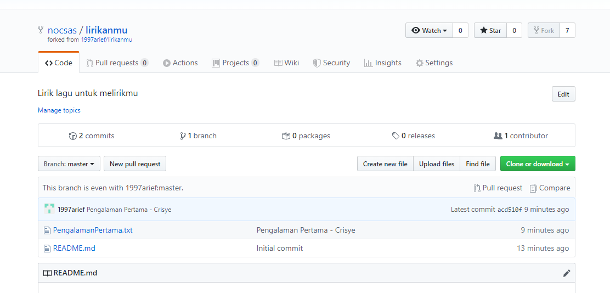
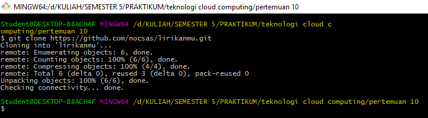
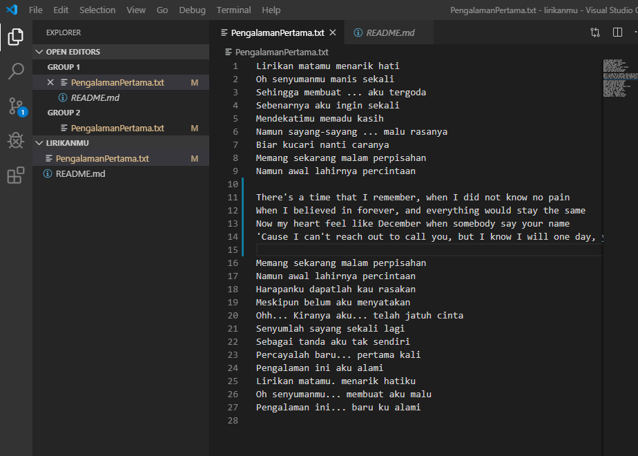
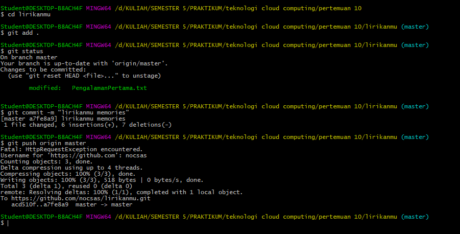
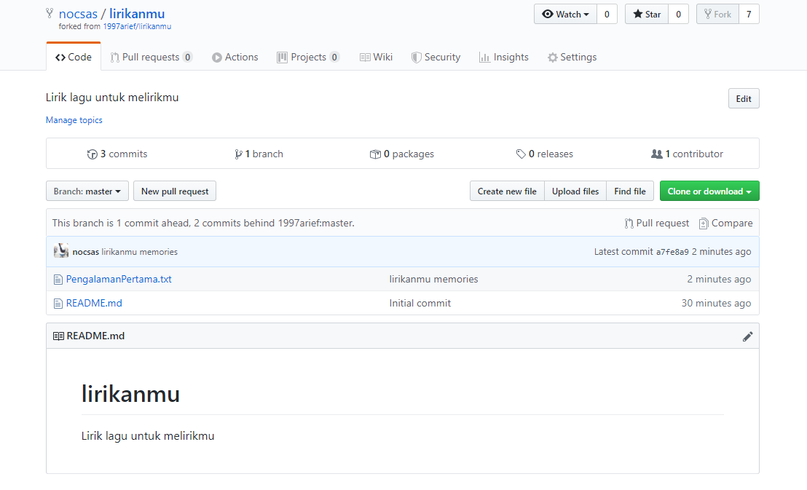
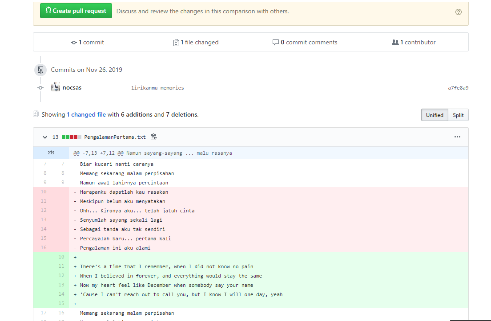
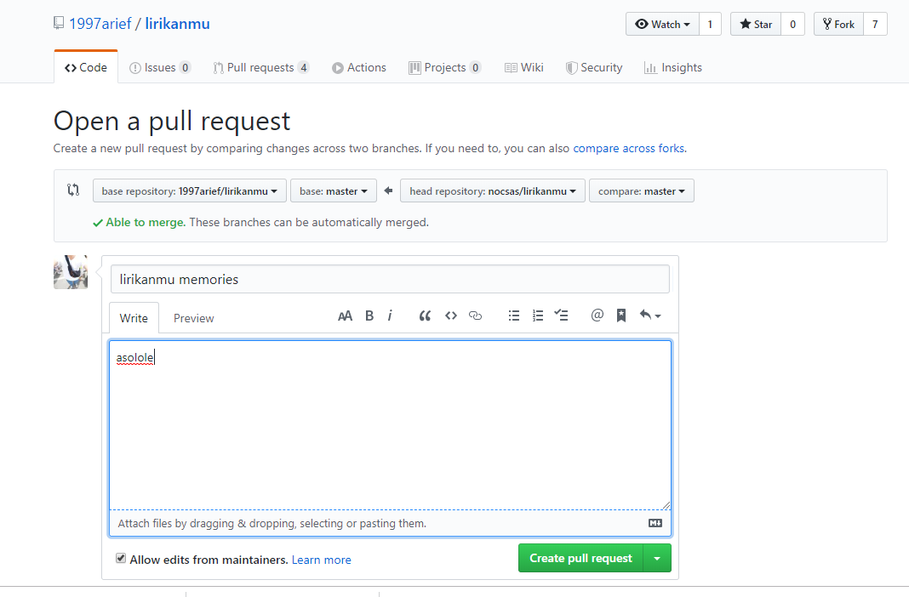
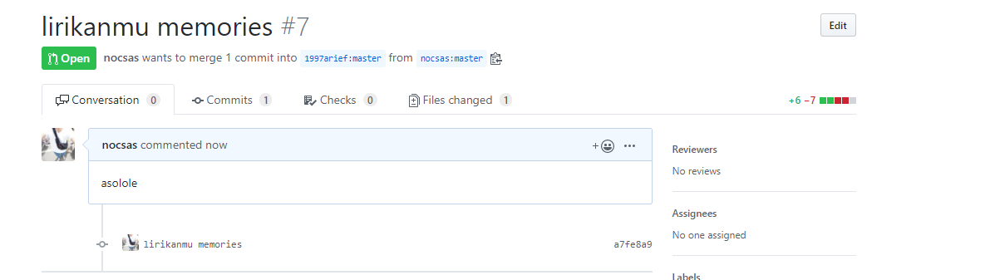
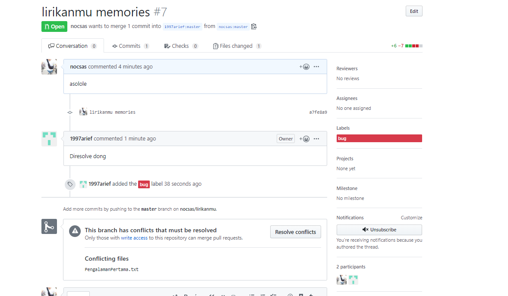
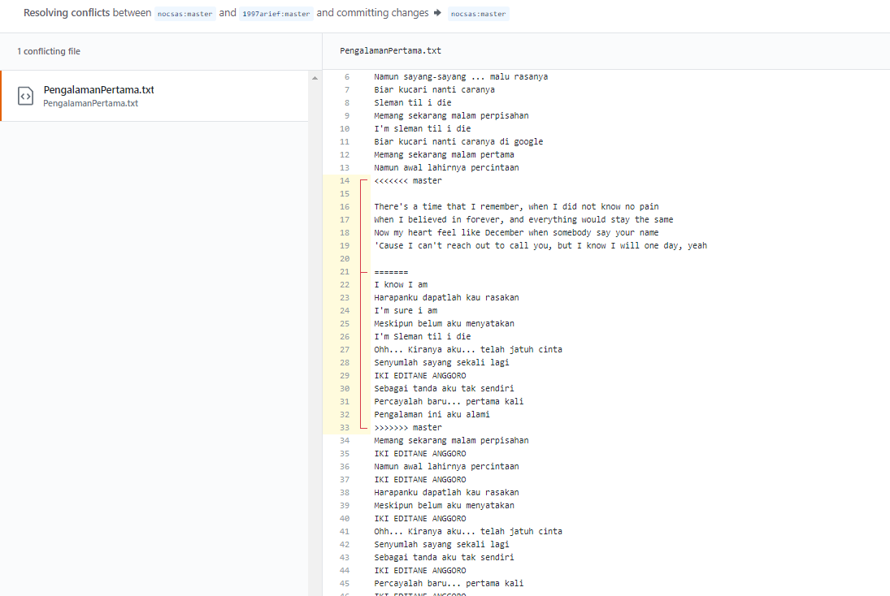

Nama : dwi sasongko mukti  
NIM : 175410010  
Jurusan : Teknik Informatika  
-------------------  

# Git untuk Kolaborasi  
## 1. Melakukan Fork lirikanmu  
  
## 2. Melakukan Clone  Repo
  
## 3. Mengedit File Yang Ada Di Repo 
  
## 4. Melakukan Push  
  
## 5. Melakukan Pull Request  
  
## 6. Melakukan Create Pull Request  
  
  
  
## 7. Terjadi Konflik  
  
## 8. Melihat File Yang Konflik  
