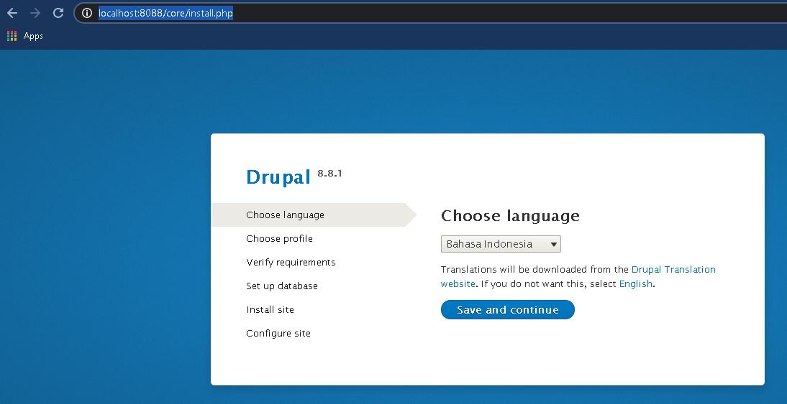

Nama : dwi sasongko mukti  
NIM : 175410010  
Jurusasn : Teknik Informatika  
Matkul : Praktikum Teknologi Cloud Computing  
----
# DRUPAL WITH DOCKER COMPOSE  

## 1.Membuat folder  
    mkdir ~/my_drupal/
    cd ~/my_drupal/

## 2.Membuat file di dalam folder docker-compose.yml  
    version: '3.3'

    services:
    drupal:
        image: drupal:latest
        ports:
        - 8088:80
        volumes:
        - drupal_modules:/var/www/html/modules
        - drupal_profiles:/var/www/html/profiles
        - drupal_themes:/var/www/html/themes
        - drupal_sites:/var/www/html/sites
        restart: always

    postgres:
        image: postgres:10
        environment:
        POSTGRES_PASSWORD: your_postgres_password
        ports:
        - 5432:5432
        volumes:
        - db_data:/var/lib/postgresql/data
        restart: always

    volumes:
    drupal_modules:
    drupal_profiles:
    drupal_themes:
    drupal_sites:
    db_data:  

## 3.Dari folder my_drupal, jalankan Docker containers  
    PS C:\Users\Prov\my_drupal> docker-compose up -d
    Creating network "my_drupal_default" with the default driver
    Pulling drupal (drupal:latest)...
    latest: Pulling from library/drupal
    d599a449871e: Pull complete
    1a363f133ddd: Pull complete
    dd6ffd5f60d7: Pull complete
    515e48bcd87c: Pull complete
    c6f3d43db193: Pull complete
    f1c6f8e807f6: Pull complete
    65d8fe3b5a08: Pull complete
    2a46b5d1a618: Pull complete
    80a23a71b657: Pull complete
    ca8777914fba: Pull complete
    d50334859dfc: Pull complete
    e649e463bd1c: Pull complete
    fbe597190285: Pull complete
    ed0793760991: Pull complete
    a4071a9a4e73: Pull complete
    3a0c698e7383: Pull complete
    Digest: sha256:5b402b033be60baf4a4448cfe1de7510e737e7c5682a70629150820f7e97df9a
    Status: Downloaded newer image for drupal:latest
    Pulling postgres (postgres:10)...
    10: Pulling from library/postgres
    d599a449871e: Already exists
    eadd55e4a4ae: Pull complete
    17eea069a47f: Pull complete
    22b703021b03: Pull complete
    5fa72174baec: Pull complete
    338e0b17322b: Pull complete
    05fd528a5e36: Pull complete
    c224328d751f: Pull complete
    f4319784a7ce: Pull complete
    6b0ef024e116: Pull complete
    5bc4176bd4c3: Pull complete
    79c29b3c031a: Pull complete
    9419079907eb: Pull complete
    4b9b9c707beb: Pull complete
    Digest: sha256:74e63f8b55e9b0ca55b78abb203d01e47c5ac7d3f10af09f91d5932943c6bb14
    Status: Downloaded newer image for postgres:10
    Creating my_drupal_drupal_1   ... done
    Creating my_drupal_postgres_1 ... done

## 4.Cek Image  
    PS C:\Users\Prov\my_drupal> docker images
    REPOSITORY                  TAG                 IMAGE ID            CREATED             SIZE
    drupal                      latest              8bffa929484d        2 days ago          561MB
    postgres                    10                  1ba73c5b23e7        2 weeks ago         280MB  

## 5.Cek Container  
    PS C:\Users\Prov\my_drupal> docker ps
    CONTAINER ID        IMAGE               COMMAND                  CREATED             STATUS              PORTS                    NAMES
    066f4f941cf5        postgres:10         "docker-entrypoint.s…"   26 minutes ago      Up 26 minutes       0.0.0.0:5432->5432/tcp   my_drupal_postgres_1
    6417ec89f970        drupal:latest       "docker-php-entrypoi…"   26 minutes ago      Up 26 minutes       0.0.0.0:8088->80/tcp     my_drupal_drupal_1  

## 6.Jalankan Drupal Di Browser  
    http://localhost:8088/core/install.php  
