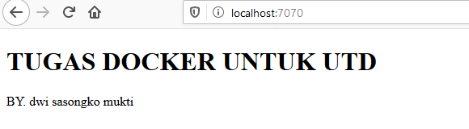

Nama    : Dwi Sasongko Mukti  
NIM     : 175410010  
Jurusan : Teknik Informatika  
Tugas   : UTS  
=====================  
  
# DOCKER IMAGE  
## Membuat Folder Baru dan Masuk Ke Dalam Folder  
  
    PS C:\Users\User> mkdir sasongko

    Directory: C:\Users\User

    Mode                LastWriteTime         Length Name
    ----                -------------         ------ ----
    d-----       10/28/2019  10:53 PM                sasongko

    PS C:\Users\User> cd sasongko  

## Membuat DockerFile  

    FROM nginx:alpine
    COPY . /usr/share/nginx/html  

## Membuat File index.html  

    <!DOCTYPE html>
    <html>
        <head>
            <title>UTS</title>
        </head>
        <body>
            <h1>TUGAS DOCKER UNTUK UTD</h1>
            
BY. dwi sasongko mukti

        </body>
    </html>  

## Membuat Image  

    PS C:\Users\User\sasongko> docker build -t nocsas/sasongko:v1 .
    Sending build context to Docker daemon  3.072kB
    Step 1/2 : FROM nginx:alpine
     ---> b6753551581f
    Step 2/2 : COPY . /usr/share/nginx/html
     ---> 4db5dca15bcc
    Successfully built 4db5dca15bcc
    Successfully tagged nocsas/sasongko:v1  

## Mengecek Image  

    PS C:\Users\User\sasongko> docker images
    REPOSITORY                TAG                 IMAGE ID            CREATED              SIZE
    nocsas/sasongko           v1                  4db5dca15bcc        About a minute ago   21.4MB  

## Push Image Ke DockerHub  

    PS C:\Users\User\sasongko> docker push nocsas/sasongko:v1
    The push refers to repository [docker.io/nocsas/sasongko]
    a1c50abfc319: Pushed                                                                                                    bba7d2385bc1: Mounted from rizh/rizh                                                                                    77cae8ab23bf: Mounted from rizh/rizh                                                                                    v1: digest: sha256:57dbbd80ecbdcf55015ed0d42005df0083a1626f4571c072cb3b2e7ebc07313c size: 946
    PS C:\Users\User\sasongko> docker push nocsas/sasongko:v1
    The push refers to repository [docker.io/nocsas/sasongko]
    a1c50abfc319: Layer already exists    

## Menjalankan Image  

    PS C:\Users\User\sasongko> docker run -d -p 7070:80 --name=nocsas nocsas/sasongko:v1
    da00341b198a6b2ea644636e4d53fb4cc68448daa60ed36e2867372e08b8e05a  

## Melihat Container dan Memastikan Statusnya Up  

    PS C:\Users\User\sasongko> docker ps
    CONTAINER ID        IMAGE                        COMMAND                  CREATED             STATUS              PORTS                  NAMES
    da00341b198a        nocsas/sasongko:v1           "nginx -g 'daemon of…"   29 seconds ago      Up 26 seconds       0.0.0.0:7070->80/tcp   nocsas  

## Mengetes Melalui Broswer  
  